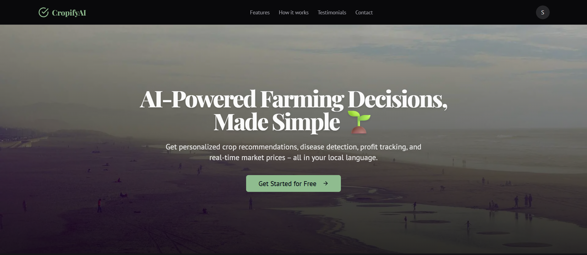

# 🌱 CropifyAI – AI-powered Smart Farming WebApp  

## 📖 Overview  
CropifyAI is a smart farming web application that empowers farmers with AI-driven crop recommendations, disease detection, financial tracking, and real-time advisories. The app is designed to work both online and offline, ensuring reliability in rural areas with poor internet connectivity.  

🌐 **[Live Demo](https://cropifyai.vercel.app/)**

- **Landing Page**  
    


## 🚀 Features  
- AI-powered Crop Recommendation: Suggests best crops based on soil, weather, and market data. 
- Image-based Disease Detection with treatment suggestions  
- Financial Tracking (expenses, income, profit calculation)  
- Market Advisory with nearby prices and alerts  
- Real-time Weather Dashboard with notifications  
- Offline Support (queued actions + background sync)  
- Multilingual Support (local language advisories)  
- User Authentication & Multiple Farm Profiles  

---

## 🛠️ Tech Stack  

**Frontend**  
- Next.js, React.js, TypeScript, Tailwind CSS  
- React Hook Form  

**Backend**  
- Next.js API Routes  
- Firebase Authentication  

**AI Components**  
- Genkit (Google Gemini)  
- Custom ML models trained on crop, soil, and weather datasets  

**Database & Storage**  
- Firebase Firestore  
- Firebase Cloud Storage  
- LocalStorage + Service Worker  

**Deployment**  
- Vercel 

---


---

## 🔄 Workflow  

1. Farmer logs in via Firebase Auth.  
2. Inputs soil details + uploads crop image.  
3. Backend fetches soil, weather, and market data.  
4. AI Engine:  
   - Recommends best crops with yield & profit.  
   - Detects diseases from uploaded images.  
5. Advisory system translates results into local languages.  
6. Farmer receives results + treatment + market insights.  
7. Notifications alert about rainfall, pest outbreaks, or price changes.  
8. Offline support queues disease analysis & financial transactions in localStorage, syncing them when internet returns.  

---

## 📦 Offline Support  

- **Queued Actions in LocalStorage**: Disease analysis & financial transactions stored locally when offline.  
- **Auto-Sync on Reconnect**: Actions automatically synced with Firebase when internet returns.  
- **Service Worker**: Handles caching & background sync for offline reliability.  

---

## 📊 Datasets & Research Sources  

- [Kaggle](https://www.kaggle.com) – Crop & disease datasets  
- [ICAR](https://icar.org.in) – Indian Council of Agricultural Research  
- [FAO](https://www.fao.org) – Food and Agriculture Organization  

**Usage:**  
Datasets are used for AI model training (crop recommendation & disease detection). Market and weather data are fetched in real-time via APIs.  

---

## 💡 Unique Value Proposition (UVP)  

- Offline support with background sync  
- AI-driven disease detection from images  
- Integrated financial tracking & profit calculation  
- Localized language advisory system  
- Real-time weather + market alerts  

---

## ⚙️ Challenges & Strategies  

| Challenge | Strategy |
|-----------|-----------|
| Poor internet connectivity | Offline support + background sync |
| Limited farmer digital literacy | Simple UI + multilingual support |
| Data accuracy for AI models | Continuous training with ICAR, FAO, Kaggle datasets |
| Trust & adoption | Localized advisory + transparent recommendations |

---

## 📸 Example User Flow  

1. Farmer logs in.  
2. Inputs soil data and uploads a crop image.  
3. AI engine processes and provides:  
   - Best crops + profit estimate.  
   - Detected disease with treatment.  
4. Results are displayed in farmer’s local language.  
5. Farmer tracks expenses & profits.  
6. Alerts sent for weather, pests, and market price changes.  


## 🖥️ Running Locally  

### Prerequisites  
- Node.js (v18 or above)  
- npm or yarn  
- Firebase account & project setup  

### Steps  

1. Clone the repository:  
   ```bash
   git clone https://github.com/your-username/cropifyai.git
   cd cropifyai

2. Install dependencies:  
   ```bash
    npm install

3. Create a .env.local file in the root folder and add Firebase + API keys:
    ```bash
    NEXT_PUBLIC_FIREBASE_API_KEY=your_api_key
    NEXT_PUBLIC_FIREBASE_AUTH_DOMAIN=your_auth_domain
    NEXT_PUBLIC_FIREBASE_PROJECT_ID=your_project_id
    NEXT_PUBLIC_FIREBASE_STORAGE_BUCKET=your_storage_bucket
    NEXT_PUBLIC_FIREBASE_MESSAGING_SENDER_ID=your_sender_id
    NEXT_PUBLIC_FIREBASE_APP_ID=your_app_id
    WEATHER_API_KEY=your_weather_api_key
    MARKET_API_KEY=your_market_api_key

4. Run the development server:
     ```bash
     npm run dev

5. Open in browser:
    ```bash
    http://localhost:3000

6. Build for production:
    ```bash
    npm run build
    npm start


